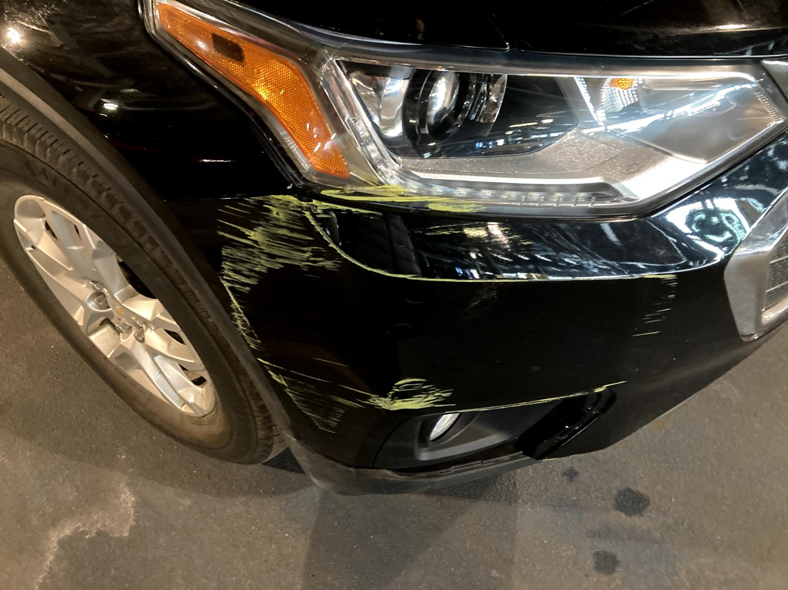
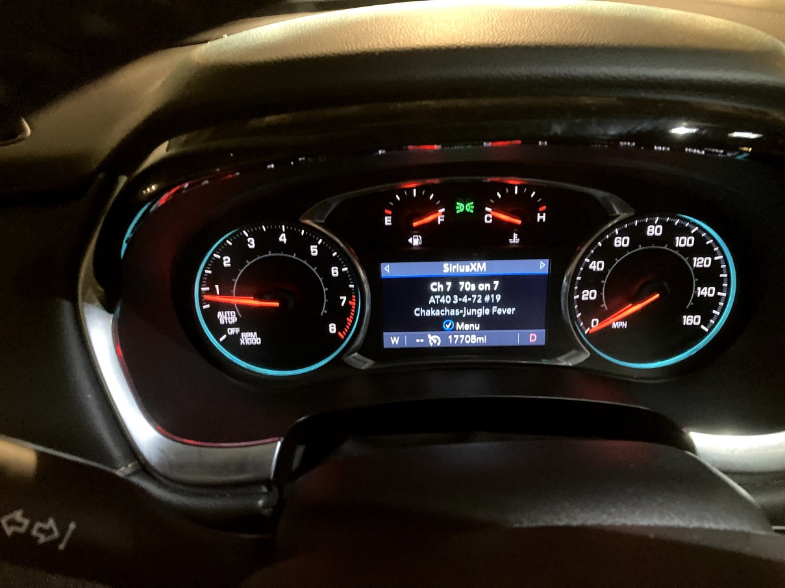
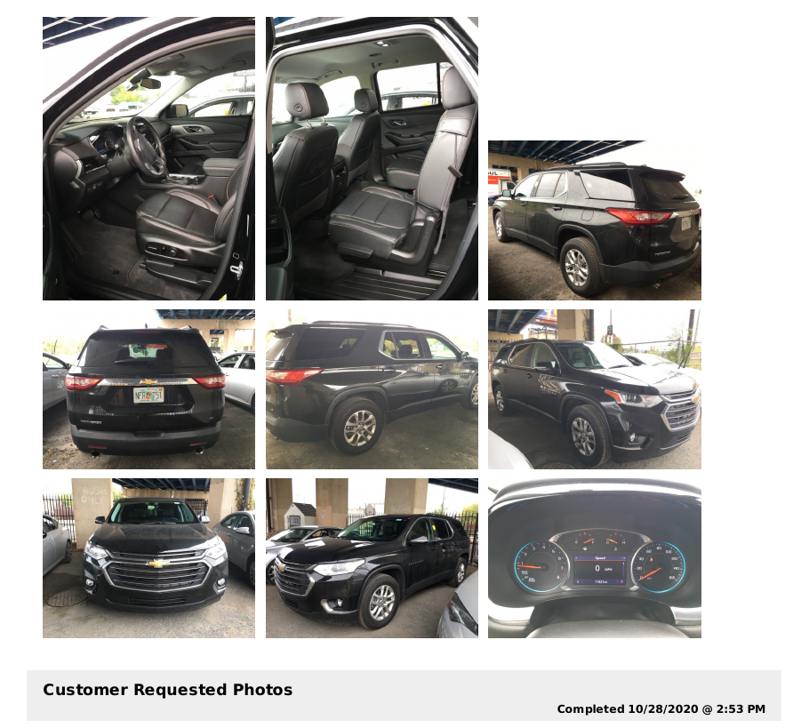

This blog post is a bit different. This one is a story about injustice which I have been dealing with for over two years.

Both Hertz and First Financial Asset Management have been harassing me for damages of a vehicle which I was not liable for. The sequence of the events concerning this case is as follows:

* At 956am on March 7 2021, I rented a Chevrolet Traverse (license plate NFRT51) from the Hertz rental at 2951 Market St, Philadelphia, PA 19104. When I went to pick up the car at the rental agency, the employee present at the counter made me sign a document that the car had no damage before handing me the keys. Only when I went downstairs to pick up my vehicle, I noticed that the car had what looked like paint scratches on its front bumper. I was under the impression that this damage was already accounted for as Hertz made me fill out the paperwork before taking the vehicle. Nevertheless, I took photos of all sides of the car before taking the car out of the parking lot. I noted the odometer reading at 17708 miles when taking the vehicle.

 

*My pre-rental inspection pictures. The existing damage to the front bumper cover is clearly visible.*

* I returned the car at 959am on March 8 2021. When I returned the keys, the Hertz representative at the counter did not come downstairs to inspect the vehicle in my presence. The odometer reading when I returned the vehicle was 17942 miles.

* On 15 April 2021, I received an email from someone named Chad Miner at Hertz who claims damages of $1129.83 for damage concerning the front bumper. The email contained a [document](../content/images/2023/hertz/documentation/013981537406_PhotoEstimate.pdf) where the damage was reported on 18 March 2021 with the car's odometer at 18290 miles. The report also contained a [pre-rental inspection report](../content/images/2023/hertz/documentation/station_report_summary_v2traverse.pdf) dated 28 October 2020 with the car's odometer at 11821 miles. In this pre-rental inspection report, the car's front bumper is unblemished.

*Note how Hertz's 'evidence' for showing the car was in good condition was taken months before we rented it.*

* I contested the claims in the email with my own pre-rental inspection photos as evidence. Mr. Miner does not address these photos when I send it to him. He provides me with a customer care number (833-932-2073) which I call several times with no response. Mr. Miner then called me on my phone number on 19 April 2021. On this call, I refused to pay for the damages. Mr. Miner said my photos are not acceptable as evidence.

* Over the next several months, I received several calls from First Financial Asset Management (FFAM) asking me to pay for the damages caused to the vehicle. I explained the situation and refused to pay every time they called. The frequency of these calls varied, but it was sometimes as often as once a week. Later on, the calls tapered off to once a month or less.

* On November 1 2021 I received a letter from FFAM with an offer to resolve the indebtedness with a one time payment of $903.86 if I pay by 29 November 2021.

* To set the record straight, I sent an email to FFAM on 11 January 2022 explaining the situation once again. This email goes unacknowledged by FFAM.

* I continue to get calls from FFAM to make a payment at irregular intervals throughout 2022. I refused to pay on each of these calls.

* On 19 May 2023 at 803am I received a call (phone number 833-784-0956) from Randy Jones at FFAM threatening me with legal action if I didn't pay on that very phone call. I clarified what legal action meant in this context multiple times and Mr. Jones said it could mean a lien though he does not mention what property the lien would be against. I restate my case but Mr. Jones disregards my statements and repeatedly says I would need to pay or face legal action. Mr. Jones then offers me the option of a one time payment of $905 or $1129 paid in two installments. Out of panic and not willing to deal with a court case when I am completely unprepared, I chose the first option to make a single payment of $905 with my credit card ending in 0079. Mr. Jones initiates the payment after taking my credit card details and billing address over the phone. He then mentions that the payment is flagged from my bank as fraud and tells me to resolve the matter with Chase while he's on the line. Before I can do so, he reports that the payment has gone through and the case is now closed.

My complaints with Hertz and FFAM in this whole situation are as follows:

* Hertz did not correctly carry out the pre-rental inspection when handing over the vehicle to me. An employee should have walked with me to the vehicle and carried out the inspection in my presence. 

* The "pre-rental" inspection report for the vehicle showing the vehicle in undamaged condition was over four months old when I rented the vehicle. The "post-rental" inspection was more than a week after I returned the vehicle. If the vehicle was indeed damaged on my trip, why did Hertz only notice ten days later after the vehicle was driven more than 350 miles since I returned it? Moreover, I find it hard to believe that a rental agency as established as Hertz would only have pictures of the vehicle four months prior to my rental with the car's odometer 6000 miles less than when I rented it. Does Hertz have no pictures of the vehicle at all in the four months before I rented it to show it was in good condition?

* Both Hertz and FFAM disregarded my photographic evidence that the vehicle was damaged before I rented it without any explanation of why they felt the evidence was invalid.

* FFAM has harassed me several times on the phone for over two years by even calling me when I was at work. I find this unacceptable.

* FFAM [did not even acknowledge my email](../content/images/2023/hertz/documentation/ffam-ignored.pdf) dated 11 Jan 2022 when I attempted to explain the situation again. The CFPB even states that the debt collector must pause collecting the debt until the debt collector has responded to my dispute. [1]

* My call with Mr. Jones on 19 May was very unpleasant. I only paid the amount under the threat of legal action and possible garnishment of wages. I have since learned that it is in fact illegal for debt collectors to garnish wages [2] so the threat was in fact empty. This has caused me a great deal of distress and I am very disappointed in the way FFAM has forced my hand to pay for damages which I did not cause.

[1] https://www.consumerfinance.gov/ask-cfpb/what-information-does-a-debt-collector-have-to-give-me-about-the-debt-en-331/

[2] https://oag.ca.gov/consumers/general/debt-collectors

Relevant Documents

[1] [Hertz damage report](../content/images/2023/hertz/documentation/013981537406_PhotoEstimate.pdf)

[2] [Hertz Pre-rental inspection report](../content/images/2023/hertz/documentation/station_report_summary_v2traverse.pdf)

[3] [Email Unacknowledged by FFAM](../content/images/2023/hertz/documentation/ffam-ignored.pdf)